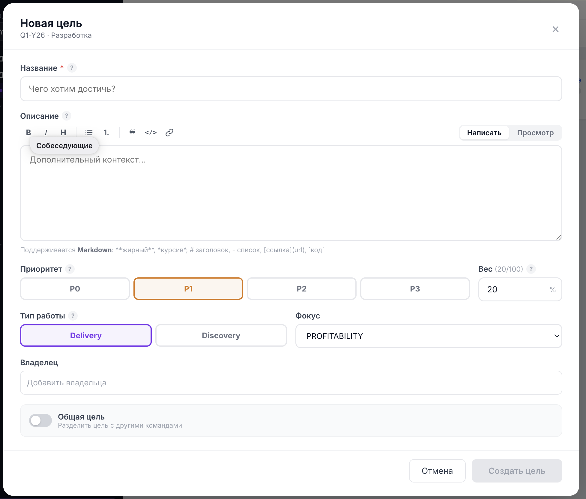

# Как ставить цели (Objectives)

Это один из двух ключевых разделов инструкции. Цель (Objective) — качественное описание того, чего команда хочет достичь за квартал. Измеримость добавляют [Key Results](key-results.md); сама цель формулируется словами, **без цифр**.

> 📷 **Скриншот:** `images/goal-modal.png` — модальное окно «Новая цель» со всеми полями: Название, Описание, Приоритет (P0–P3), Вес, Тип работы, Фокус, Владелец, переключатель «Общая цель».
>
> 

---

## На каком этапе заводят цели

Цели создают на этапе **«Черновик»** (а также из состояния «Нет целей» — создание первой цели). В этих состояниях интерфейс работает в режиме полного редактирования: доступны создание, изменение, перетаскивание и удаление целей и Key Results.

В статусе **«В работе»** кнопка создания целей скрыта — структура квартала к этому моменту уже зафиксирована. См. [Жизненный цикл](lifecycle.md).

---

## How-to: создать цель

1. Откройте команду на `/teamOkrs` и выберите нужный период.
2. Убедитесь, что команда в статусе **«Черновик»** (или «Нет целей»).
3. Нажмите кнопку **«+ Добавить цель»** в правом верхнем углу области целей.
4. Заполните поля модального окна (см. ниже).
5. Нажмите **«Создать цель»**.

> 📷 **Скриншот:** `images/goal-add-button.png` — кнопка «+ Добавить цель» в topbar над списком целей.

---

## Поля цели

### Название (Objective) — обязательно

Качественная формулировка того, чего хочет достичь команда. Отвечает на вопрос **«Чего хотим достичь?»**.

- Без цифр и метрик — они живут в Key Results.
- Коротко, амбициозно и понятно человеку извне команды.

✅ «Сделать онбординг новых пользователей быстрым и понятным»
❌ «Поднять конверсию онбординга до 40%» (это формулировка Key Result, а не цели)

### Описание

Контекст: **почему** эта цель важна. Не дублируйте название.

- Поддерживает **Markdown** (жирный, курсив, заголовки, списки, цитаты, ссылки, инлайн-код). См. [Возможности интерфейса → Markdown](interface.md#markdown).

### Приоритет

Относительная важность цели:

| Приоритет | Значение |
| --- | --- |
| **P0** | must-have, критично |
| **P1** | высокий приоритет |
| **P2** | важная |
| **P3** | желательная |

### Вес

Доля цели в общем результате команды, в процентах. **Сумма весов всех целей команды должна быть равна 100%.**

- Под полем показывается счётчик `(текущая сумма / 100)`.
- Если суммарный вес превышает 100%, поле подсветится красным с сообщением «Превышает 100%».

> 💡 Вес — это инструмент приоритизации. Более важные цели получают больший вес и сильнее влияют на общий прогресс команды.

### Тип работы

- **Delivery** — известный результат, который надо доставить (понятно, что и как делать).
- **Discovery** — исследование гипотезы (результат заранее не известен).

### Фокус

Стратегический фокус цели. Доступные значения:

- **PROFITABILITY** — прибыльность
- **STABILITY** — стабильность
- **SPEED_EFFICIENCY** — скорость и эффективность
- **TECH_INDEPENDENCE** — технологическая независимость

### Владелец

Один или несколько ответственных за цель. Поле с поиском: начните вводить имя — система предложит пользователей из вашей зоны видимости. Выбранные владельцы отображаются с аватарками; лишнего можно убрать.

### Общая цель (share)

Переключатель **«Общая цель»** позволяет разделить одну и ту же цель с другими командами — чтобы посадить в одну лодку несколько команд с общим результатом.

- Включите переключатель и выберите команды, с которыми делите цель.
- Цель остаётся единой (одна identity), но становится видимой у команд-партнёров; у каждой команды может быть свой вес этой цели.
- Это отдельная большая тема — подробно описана в документе [Общие (шаренные) цели](shared-goals.md).

> 📷 **Скриншот:** `images/goal-shared-toggle.png` — включённый переключатель «Общая цель» и выбор команд-партнёров.

---

## How-to: редактировать цель

1. В режиме «Черновик» / «К валидации» наведите курсор на заголовок цели — появится иконка карандаша.
2. Кликните по заголовку (или карандашу) — откроется то же модальное окно.
3. Внесите правки и нажмите **«Сохранить»**.

## How-to: изменить порядок целей

В режиме полного редактирования цели можно перетаскивать (drag-and-drop), чтобы задать удобный порядок.

## How-to: удалить цель

1. В режиме «Черновик» / «К валидации» рядом с заголовком цели появляется красный крестик.
2. Нажмите его и подтвердите удаление.
3. Если цель была собственной — она удаляется полностью (вместе с Key Results). Если цель была общей (расшарена вам другой командой) — удаляется только её привязка к вашей команде.

> ⚙️ Если вы удалили последнюю цель команды в периоде, система автоматически переведёт статус в «Нет целей».

---

## Чек-лист хорошей цели

- [ ] Сформулирована качественно, без цифр.
- [ ] Понятна человеку вне команды.
- [ ] Назначен приоритет (P0–P3).
- [ ] Задан вес; сумма весов всех целей = 100%.
- [ ] Выбран тип работы (Delivery / Discovery) и фокус.
- [ ] Назначен хотя бы один владелец.
- [ ] К цели заведены измеримые [Key Results](key-results.md).

---

## FAQ

**Сколько целей заводить на квартал?**
Жёсткого ограничения нет, но практика OKR — 3–5 целей на команду, чтобы сохранить фокус.

**Можно ли в названии цели написать целевую метрику?**
Лучше нет. Метрики выносите в Key Results — так прогресс считается автоматически.

**Почему счётчик веса красный?**
Сумма весов целей превысила 100%. Уменьшите вес одной из целей.

**Я не вижу кнопку «+ Добавить цель».**
Скорее всего команда в статусе «В работе» или «Закрыты», где создание целей закрыто. Проверьте статус в [степпере](lifecycle.md). Либо у вас нет доступа на редактирование этой команды.

**Дальше:** [Как заводить Key Results →](key-results.md)
