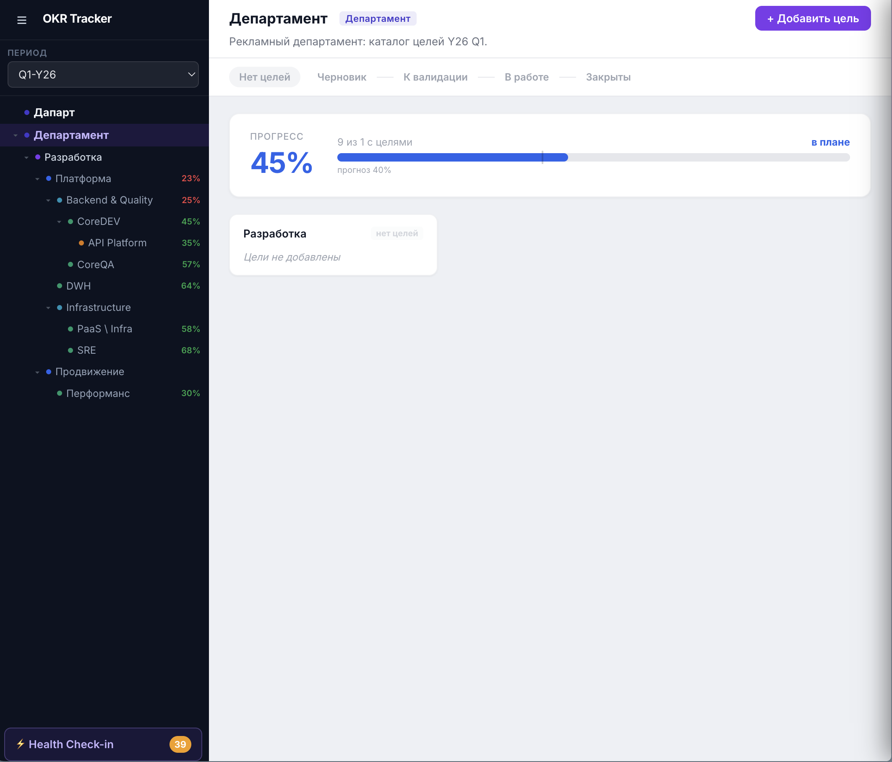

# OKR Tracker — инструкция для сотрудников

Добро пожаловать в инструкцию по работе с **OKR Tracker**. Здесь собрано всё, что нужно команде, чтобы поставить квартальные цели, согласовать их, вести прогресс в течение квартала и корректно закрыть период.

> 📷 **Скриншот:** `images/tracker-overview.png` — общий вид страницы `/teamOkrs`: слева тёмный сайдбар с деревом команд и выбором периода, справа — название команды, общий прогресс, степпер статусов и список карточек целей.
>
> 

---

## С чего начать

Если вы открыли трекер впервые — пройдите по шагам в том порядке, в котором живёт квартал:

| Этап квартала | Что делаете | Раздел |
| --- | --- | --- |
| 1. Черновик | Заводите цели и Key Results | [Как ставить цели](goals.md) · [Как заводить Key Results](key-results.md) · [Общие цели](shared-goals.md) |
| 2. К валидации | Передаёте цели на проверку, обсуждаете в комментариях | [Валидация и комментарии](validation.md) |
| 3. В работе | Обновляете прогресс, пишете заметки и чек-ины | [Работа в середине квартала](mid-quarter.md) |
| 4. Закрыты | Подводите итоги квартала | [Закрытие квартала](closing.md) |

Сквозные материалы:

- [Общие (шаренные) цели](shared-goals.md) — как одна цель объединяет несколько команд.
- [Жизненный цикл OKR и статусы](lifecycle.md) — как устроен квартальный процесс целиком.
- [Возможности интерфейса](interface.md) — навигация, ссылки, индикаторы здоровья, Markdown, настройки.
- [FAQ](faq.md) — короткие ответы на частые вопросы.

---

## Что такое OKR в этой системе (коротко)

- **Цель (Objective)** — качественное описание того, чего команда хочет достичь за квартал. Без цифр.
- **Key Result (KR)** — измеримый результат, который показывает, достигли ли цели. Цифры и факты живут здесь.
- **Прогресс цели** = взвешенное среднее прогресса её Key Results.
- **Прогресс команды за период** = взвешенное среднее прогресса её целей.

> 💡 Главная мысль: **формулировка целей и грамотный выбор Key Results — это 80% успеха.** Большая часть этой инструкции посвящена именно этому: смотрите [Как ставить цели](goals.md) и [Как заводить Key Results](key-results.md).

---

## Базовая навигация

- Трекер команды открывается по адресу **`/teamOkrs`**.
- Слева в сайдбаре — **дерево команд** (в пределах вашего доступа) и **выбор периода**.
- Внизу сайдбара — **виджет аккаунта** (аватар, имя, выход, ссылка на настройки).
- Справа — основная область: название команды, общий прогресс, **степпер статусов** и список целей.

Подробнее про все элементы интерфейса — в разделе [Возможности интерфейса](interface.md).

---

## Если у вас нет доступа к командам

Если в сайдбаре вы видите заглушку «Нет доступа к командам» — обратитесь к администратору, чтобы он выдал доступ к нужному узлу иерархии. Без выданного доступа команды не отображаются.
