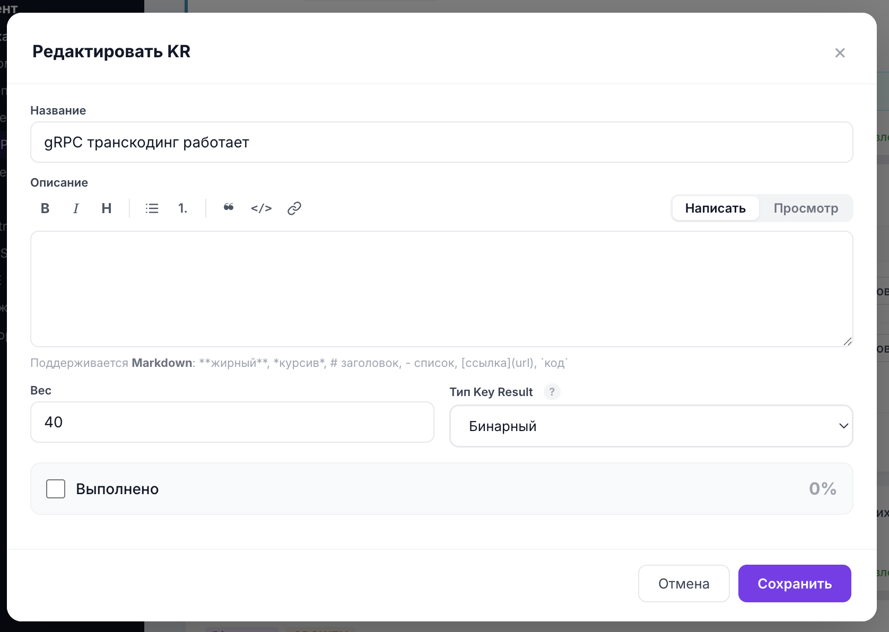

# Как заводить Key Results

Это второй ключевой раздел инструкции. **Key Result (KR)** — измеримый результат, который показывает, достигли ли вы цели. Если [цель](goals.md) отвечает на вопрос «чего хотим достичь», то KR отвечает на вопрос «как мы поймём, что достигли».

Прогресс цели рассчитывается автоматически как **взвешенное среднее прогресса её Key Results** — поэтому от того, как вы выберете тип KR и зададите его параметры, зависит корректность всей картины прогресса.

> 📷 **Скриншот:** `images/kr-modal.png` — модальное окно «Добавить KR»: поля Название, Описание, Вес, Тип Key Result, и блок параметров под выбранный тип.
>
> 

---

## На каком этапе заводят Key Results

Key Results создают и редактируют там же, где и цели — в статусах **«Черновик»** и **«К валидации»** (режим полного редактирования). В статусе **«В работе»** структуру KR уже не меняют — там только обновляют прогресс (см. [Работа в середине квартала](mid-quarter.md)).

---

## How-to: создать Key Result

1. На карточке цели раскройте блок Key Results.
2. Нажмите **«+ Добавить KR»** (доступно в режиме полного редактирования).
3. Заполните название, описание, вес и **выберите тип** Key Result.
4. Заполните параметры выбранного типа (см. ниже).
5. Нажмите **«Сохранить»**.

---

## Общие поля любого KR

| Поле | Назначение |
| --- | --- |
| **Название** | Что измеряет этот KR. Отвечает на вопрос «Что измеряет этот KR?» |
| **Описание** | Контекст и пояснения. Поддерживает [Markdown](interface.md#markdown). |
| **Вес** | Доля KR внутри цели (0–100). Влияет на вклад KR в прогресс цели. |
| **Тип Key Result** | Способ измерения: Бинарный, Проектный или Числовой (см. ниже). |

> 💡 Вес распределяет важность Key Results внутри одной цели. Более значимые результаты получают больший вес.

---

## Три типа Key Result — и как выбрать нужный

Рядом с полем «Тип Key Result» есть значок-подсказка (ⓘ) с кратким описанием каждого типа. Вот развёрнуто:

### 1. Бинарный (BOOLEAN)

Результат либо **выполнен**, либо **нет**. Промежуточных состояний нет.

- **Прогресс:** 0% или 100%.
- **Когда выбирать:** результат нельзя или не нужно дробить — он либо случился, либо нет.
- **Примеры:** «Проведён аудит безопасности», «Запущен новый сервис», «Подписан контракт с подрядчиком».

> 📷 **Скриншот:** `images/kr-boolean.png` — параметры бинарного KR: единственный чекбокс «Выполнено» с индикатором 0% / 100%.

### 2. Проектный (PROJECT)

Результат состоит из нескольких **этапов**, у каждого свой вес.

- **Прогресс:** сумма весов завершённых этапов (от 0 до 100).
- **Сумма весов этапов должна быть равна 100.** В форме есть индикатор «Сумма: N», который подсвечивается, если сумма не равна 100.
- **Когда выбирать:** работа естественно делится на заметные шаги, и хочется видеть частичный прогресс.
- **Примеры:** «Миграция на новую платформу» с этапами «Спроектировать → Перенести данные → Переключить трафик → Вывести старую».

How-to задать этапы:
1. Выберите тип «Проектный».
2. Нажимайте **«+ Добавить шаг»**, вводите название и вес каждого шага.
3. Отметьте уже выполненные шаги галочкой.
4. Следите, чтобы сумма весов = 100.

> 📷 **Скриншот:** `images/kr-project.png` — список шагов проекта с чекбоксами, названиями и весами, и индикатор «Сумма: 100».

### 3. Числовой (NUMERICAL)

Результат измеряется **числом**: проценты, деньги, RPS, штуки, дни, миллисекунды и т.д.

- **Прогресс:** считается линейно от стартового значения к целевому (работает в обе стороны — и рост, и снижение). Можно задать промежуточные значения (чекпойнты) для нелинейной шкалы.
- **Когда выбирать:** есть метрика, у которой понятны старт, цель и текущее значение.
- **Примеры:** «Снизить p95 latency с 800 мс до 300 мс», «Вырасти с 1000 до 5000 заказов», «Достичь 99.9% доступности».

Параметры числового KR:

| Поле | Назначение |
| --- | --- |
| **Стартовое значение** | Точка отсчёта (0% прогресса). |
| **Цель** | Целевое значение (100% прогресса). |
| **Текущее значение** | Где находимся сейчас. |
| **Единица измерения** | Выбирается из справочника (см. ниже) — не свободный текст. |
| **Промежуточные значения** (опционально) | Чекпойнты «значение → процент» для нелинейной шкалы. |
| **Критерий обнуления** (опционально) | Текстовое условие, при котором результат считается обнулённым (справочно). |

**Справочник единиц измерения** (закрытый список): `%`, `RPS`, `мс`, `сек`, `мин`, `час`, `дней`, `шт`, `₽`, `запросов`, `ошибок`, `пользователей`, `заказов`, `рублей`.

> 📷 **Скриншот:** `images/kr-numerical.png` — параметры числового KR: стартовое значение, единица, цель, текущее значение, блок «Промежуточные значения» и кнопка «Критерий обнуления».

#### Промежуточные значения (чекпойнты)

Промежуточное значение задаёт, **какой процент достижения KR соответствует конкретному значению метрики**. Прогресс интерполируется линейно между стартом (0%), промежуточными значениями и целью (100%).

Используйте, когда «равные шаги метрики» не означают «равный прогресс». Например, последние проценты доступности даются тяжелее первых.

How-to:
1. В блоке «Промежуточные значения» нажмите **«+ Добавить промежуточное значение»**.
2. Укажите значение метрики и соответствующий ему процент (0–100).
3. Значения не должны дублироваться.

#### Критерий обнуления

Текстовое человекочитаемое условие, при котором результат считается несостоявшимся (например, «если был инцидент уровня SEV1»). Это справочное поле — в авторасчёте прогресса оно не участвует, но видно команде и при обновлении прогресса.

---

## Как выбрать тип: быстрая шпаргалка

```
Результат измеряется числом (метрика со стартом и целью)?
   └─ Да  ─────────────────────────────► Числовой (NUMERICAL)
   └─ Нет
        Работа делится на этапы и важен частичный прогресс?
            └─ Да ───────────────────────► Проектный (PROJECT)
            └─ Нет (либо сделано, либо нет) ► Бинарный (BOOLEAN)
```

| Ситуация | Тип |
| --- | --- |
| «Поднять метрику с X до Y» | Числовой |
| «Снизить время / число ошибок до Y» | Числовой |
| «Пройти проект по этапам» | Проектный |
| «Выкатить фичу / провести событие» (да/нет) | Бинарный |

---

## How-to: редактировать, переупорядочить, удалить KR

- **Редактировать:** кнопка «Редактировать» у KR (в режиме полного редактирования) открывает то же модальное окно.
- **Переупорядочить:** перетаскивание (drag-and-drop) в режиме полного редактирования.
- **Удалить:** красный крестик справа от кнопки «Редактировать»; требует подтверждения.

---

## Как считается прогресс (справочно)

- **Бинарный:** 100% или 0%.
- **Проектный:** сумма весов завершённых этапов (clamp 0..100).
- **Числовой без чекпойнтов:** линейно от старта к цели; ниже старта → 0%, на цели и выше → 100%.
- **Числовой с чекпойнтами:** линейная интерполяция между стартом (0%), чекпойнтами и целью (100%).
- **Прогресс цели** = взвешенное среднее прогресса её KR.

> Цель без KR даёт 0%. Цель, у которой суммарный вес KR равен 0, тоже даёт 0%.

---

## Чек-лист хорошего Key Result

- [ ] Измеримый: понятно, как определить «достигнут».
- [ ] Выбран корректный тип (числовой / проектный / бинарный).
- [ ] Для числового — заданы старт, цель, единица из справочника.
- [ ] Для проектного — сумма весов этапов = 100.
- [ ] Задан вес KR внутри цели.
- [ ] В названии — что измеряем, а не как делаем.

---

## FAQ

**Сколько KR на одну цель?**
Обычно 2–5. Слишком много KR размывают фокус.

**Можно ли поменять тип KR после создания?**
Да, в режиме редактирования (статусы «Черновик» / «К валидации»). После перехода «В работе» структуру не меняют.

**Я не нашёл нужную единицу измерения.**
Список единиц закрытый. Выберите ближайшую подходящую; варианта «другое» и произвольного текста нет.

**Почему индикатор «Сумма» у проектного KR красный?**
Сумма весов этапов не равна 100. Поправьте веса шагов.

**Когда использовать промежуточные значения?**
Когда прогресс по метрике нелинейный — например, последние проценты даются сложнее. В остальных случаях достаточно старта и цели.

**Дальше:** [Валидация и комментарии →](validation.md)
