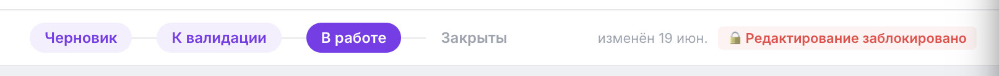

# Жизненный цикл OKR и статусы

OKR команды живут в рамках **периода** (квартала). У каждой пары «команда + период» есть статус, который отражает, на каком этапе квартала находится команда. Статус управляется через **степпер статусов** в верхней части страницы команды.

> 📷 **Скриншот:** `images/status-stepper.png` — степпер статусов в topbar: четыре шага «Черновик → К валидации → В работе → Закрыты», текущий шаг подсвечен акцентным цветом.
>
> 

---

## Четыре шага степпера

| Шаг в интерфейсе | Что означает | Что можно делать |
| --- | --- | --- |
| **Черновик** | Цели заполняются и редактируются | Полное редактирование: создавать, менять и удалять цели и Key Results |
| **К валидации** | Цели сформированы и переданы на проверку | Редактирование ещё доступно (можно поправить по итогам валидации) |
| **В работе** | Квартал идёт, обновляется прогресс | Обновление прогресса KR, заметки, комментарии |
| **Закрыты** | Квартал завершён, подводятся итоги | Только комментарии |

Отдельно, до первого шага, существует техническое состояние:

- **Нет целей** — у команды в этом периоде ещё нет ни одной цели. В степпере показывается специальный бейдж «Нет целей», шаги недоступны. Как только вы создадите первую цель — переведите команду в «Черновик».

> ⚙️ Когда вы удаляете последнюю цель команды в периоде, система **автоматически** возвращает статус в «Нет целей».

---

## Как сменить статус

How-to:

1. Откройте команду на странице `/teamOkrs` и выберите нужный период в сайдбаре.
2. В степпере наверху кликните по нужному шагу.
3. Статус сохранится сразу — перезагрузка не нужна.

> 💡 Степпер задаёт **режим работы** интерфейса. Например, в «В работе» кнопки создания целей и Key Results скрыты, чтобы случайно не менять структуру квартала — остаются только обновление прогресса и комментарии.

---

## Как это связано с этапами квартала

```
Нет целей ──► Черновик ──► К валидации ──► В работе ──► Закрыты
              (заводим      (валидация,     (чек-ины,     (итоги)
               цели и KR)    обсуждение)     прогресс)
```

- **Черновик** → читайте [Как ставить цели](goals.md) и [Как заводить Key Results](key-results.md).
- **К валидации** → читайте [Валидация и комментарии](validation.md).
- **В работе** → читайте [Работа в середине квартала](mid-quarter.md).
- **Закрыты** → читайте [Закрытие квартала](closing.md).

---

## FAQ

**Можно ли вернуться с «В работе» обратно в «Черновик»?**
Технически степпер позволяет переключить шаг назад. Но это организационное решение команды и лида: после валидации структура целей считается зафиксированной. Возвращайтесь к редактированию только при явной договорённости.

**Что произойдёт со статусом, если я удалю все цели?**
Система сама переведёт команду в состояние «Нет целей».

**Кто может менять статус?**
Любой пользователь, у которого есть доступ (грант) к этой команде.
