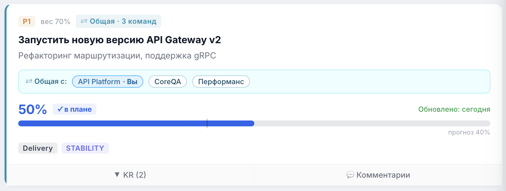

# Общие (шаренные) цели

Общая цель — это одна и та же цель, которую одновременно ведут несколько команд. Её назначение — **посадить в одну лодку несколько разных команд**: дать им единый результат, за который они отвечают вместе, без дублирования цели в каждой команде.

> 📷 **Скриншот:** `images/goal-card-shared.png` — карточка общей цели с баннером «Общая с: …» и пометкой «· Вы».
>
> 

---

## Зачем нужны общие цели

- **Общая ответственность.** Когда результат зависит от нескольких команд, цель ставится одна на всех — все видят один и тот же объект и его прогресс.
- **Без дублирования.** Цель не копируется в каждую команду. Это единая сущность: правки структуры видны всем командам-участникам.
- **Прозрачность.** Каждая команда видит, что цель общая, и с кем именно она разделена.

---

## Как это устроено

- **Цель может быть разделена любым количеством команд** одновременно — ограничения на число команд-участников нет.
- **Структура цели общая.** Состав Key Results, их типы и параметры — единые для всех команд. Изменение структуры отражается у всех участников.
- **Веса могут различаться.** У каждой команды-участника может быть **свой вес** этой цели — потому что вклад цели в общий результат у разных команд разный.

> 💡 Общая цель не меняет свою identity при шаринге — она остаётся одной целью. Шаринг лишь добавляет её видимость и собственный вес для других команд.

---

## How-to: сделать цель общей

1. Создайте или откройте на редактирование цель (в статусе «Черновик» / «К валидации»). См. [Как ставить цели](goals.md).
2. Включите переключатель **«Общая цель»**.
3. В появившемся блоке **«С какими командами»** выберите одну или несколько команд-участников.
4. Сохраните цель.

> 📷 **Скриншот:** `images/goal-shared-toggle.png` — включённый переключатель «Общая цель» и выбор команд-партнёров.

---

## How-to: задать свой вес общей цели

Вес общей цели можно задать отдельно для каждой команды:

1. Откройте цель у нужной команды.
2. Измените её вес.
3. Сохраните — у других команд-участников их собственные веса не изменятся.

---

## Как общая цель выглядит на карточке

- На карточке показывается баннер **«Общая с:»** со списком команд-участников.
- Ваша команда в этом списке помечается суффиксом **«· Вы»**.
- В мета-строке есть бейдж **«Общая · N команд»** — счётчик внешних команд-партнёров (текущая команда в счётчике не учитывается).

---

## How-to: выйти из общей цели / удалить её

Поведение удаления зависит от роли вашей команды:

- **Если ваша команда — владелец цели:** удаление убирает цель целиком (вместе со всеми Key Results и всеми привязками к другим командам).
- **Если цель просто разделена с вашей командой:** удаление убирает только привязку вашей команды — у остальных участников цель остаётся.

Чтобы перестать делить цель с командой, можно также выключить переключатель «Общая цель» (или убрать команду из списка) при редактировании.

---

## FAQ

**Со сколькими командами можно разделить цель?**
С любым количеством — ограничения нет.

**Если я изменю Key Result в общей цели, это увидят другие команды?**
Да. Структура общей цели единая для всех участников.

**Могут ли у разных команд быть разные веса одной общей цели?**
Да. Вес задаётся отдельно для каждой команды — структура общая, веса индивидуальны.

**Что произойдёт с целью, если команда-участник удалит её у себя?**
Если это не команда-владелец — удалится только привязка этой команды, у остальных цель сохранится. Если удаляет владелец — цель удаляется целиком.

**Назад:** [Как ставить цели](goals.md) · [Стартовая страница](index.md)
